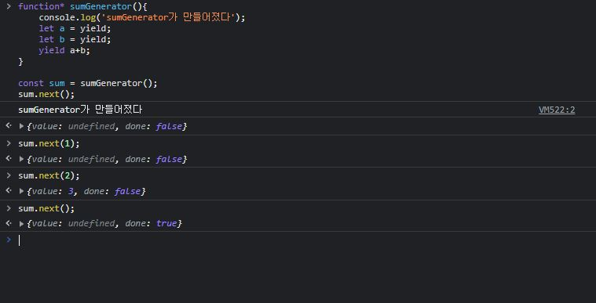

## 230305

```js
function weirdFunction() {
  return return1;
  return return2;
  return return3;
  return return4;
}

function* generatorFunction() {
  //*: generator함수 만들겠다.
  console.log("hello");
  yield 1;
  //yield: 내보낸다
  console.log("generator function");
  yield 2;
  console.log("function*");
  yield 3;
  return 4;
}

const generator = generatorFunction();

generator.next(); //hello
generator.next();
generator.next();
generator.next();
```


<br>

```js
function* sumGenerator() {
  console.log("sumGenerator가 만들어졌다");
  let a = yield;
  let b = yield;
  yield a + b;
}

const sum = sumGenerator();
sum.next(1);
sum.next(2);
sum.next();
```



<br>

```js
function* watchGenerator() {
  console.log("모니터링 중...");
  let prevAction = null;
  while (true) {
    const action = yield;
    console.log("이전 액션 : ", prevAction);
    prevAction = action;
    if (action.type === "HELLO") {
      console.log("안녕하세요");
    }
  }
}
const watch = watchGenerator();
watch.next();
watch.next({ type: "TEST" });
watch.next({ type: "HELLO" });
```


<br>

경로:react/redux-saga

```
$ yarn add axios
$ yarn add redux react-redux redux-actions
$ yarn add redux-devtools-extension
$ yarn add redux-logger
$ yarn add redux-thunk
$ yarn add redux-saga
```

### redux-saga

redux-saga가 제공하는 **select**는 사가 내부에서 현재 스토어를 조회하는 방법

- 우리가 만든 리액트 프로젝트는 기본적으로 클라이언트 사이드 렌더링만 하고 있다.
- 클라이언트 사이드 렌더링은 UI렌더링을 브라우저에서 모두 처리하는 것이다.
- 즉 자바스크립트를 불러온 다음에 실행이 되어야 우리가 만든 화면이 사용자에게 보여진다.

<br>

### remix

[리믹스 짧은 설명](https://remix.run/docs/en/main/tutorials/blog)

```
$ npx create-remix hello-remix
Just the basics
Remix App Server
JavaScript
yes

$ npx create-remix hello-remix
? What type of app do you want to create? Just the basics
? Where do you want to deploy? Choose Remix if you're unsure; it's easy to
change deployment targets. Remix App Server
? Do you want me to run `npm install`? No
? TypeScript or JavaScript? JavaScript

$ cd hello-remix
$ yarn
$ yarn dev
ctrl+로컬 주소
```

<br>

**개발자도구 확인**

1. 개발자도구
2. Network
3. Response
4. Pretty Print

```js
//http://localhost:3000/articles/3
//react\hello-remix\app\routes\articles\$id.jsx
//서버 사이드 렌더링이 해당 파일만 불러옴

import { useParams } from "@remix-run/react";

export default function Article() {
  const params = useParams();
  return <div>게시글 ID: {params.id}</div>;
}
```


### Outlet

- 공통된 레이아웃을 가진 라우트들을 구성할 때(메뉴)

<br>

[가짜API](https://jsonplaceholder.typicode.com/)
https://jsonplaceholder.typicode.com/users/7
(7번 id만 불러옴)

```
yarn add axios
```

- Remix 프로젝트에서 데이터를 불러올 때는 loder와 useLoderData라는 hoook을 사용

<br>

```js
//http://localhost:3000/users/5
//react\hello-remix\app\routes\users\$id.jsx
import { json } from "@remix-run/node";
import { useLoaderData } from "@remix-run/react";
import { getUser } from "../../lib/api";

export const loader = async ({ params }) => {
  const { id } = params;
  const user = await getUser(id);
  return json(user);
};

export default function User() {
  const user = useLoaderData();

  return (
    <div>
      <h2>{user.username}</h2>
      <code style={{ whiteSpace: "pre" }}>{JSON.stringify(user, null, 2)}</code>
    </div>
  );
}
```

Remix에서 다른 라우트로 이동할때 주소가 바뀌어도 데이터 불러오기가 끝날때까지 이전 라우트의 UI가 화면에 나타난다.
클라이언트 라우딩을 하면서 데이터를 새로 요청하지만 이때 loader함수 로직이 브라우저에서 직접 호출되는게 아니라 loader함수는 서버에서만 실행되며 그 응답의 결과만 브라우저에서 받아서 사용한다.
즉, 라우트 이동을 하면서 Remix에서 내부적으로 /user/1?\_data=routes%2Fusers%2F%24id 경로에 요청을 한 것을 볼 수 있다.
Remix서버에서는 이러한 요청을 받으면 해당 라우트의 loader를 실행하고 그 결과를 응답한다.
loader에서 사용한 로직은 무조건 서버 측에서만 호출되며, 추후 프로젝트를 빌드 할 때 클라이언트측 번들링 결과에 포함되지 않는다. 여기에 입력되는 코드는 사용자에게 절대 노출되지 않기 때문에 필요에 따라 이 함수 내에서 데이터베이스에 직접 접근을 하거나 민감한 알고리즘을 다뤄도 안전하다.

<br>

Remix애서 데이터쓰기의 권장방식은 Form기반이다.

```
$ npx json-server ./data.json --port 4000 -d 500
```

### action, Form

라우트에서 데이터 쓰기응 하고싶다면
action이라는 함수를 만들어서 내보내줘야 한다.
이 함수에서는 request파라미터를 통해 브라우저에서 요청한 데이터를 Form Data형식으로 조회할 수 있다.

```
$ yarn build
```

<br>

### next.js

```
$ yarn create next-app hello-next
```

```
$ npx create-next-app@latest
개발환경실행 npm run dev
배포 파일 생성 npm run build
서비스 시작 npm run start
```

<br>

클라이언트쪽에서 필요로 하는 데이터를 서버쪽에서 공급하게 할 수 있다.
http://a.com/api
/pages/api/index.js

[환경변수로 저장하는 방법 참고](https://nextjs.org/docs/basic-features/environment-variables)

