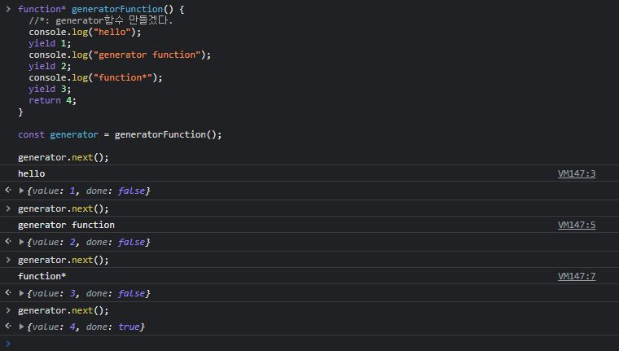
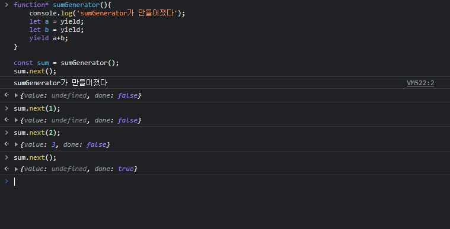
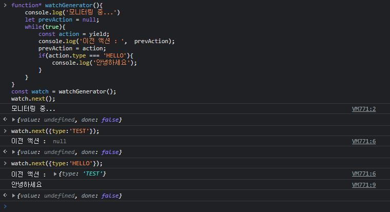
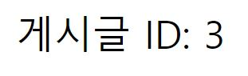
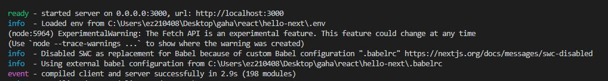

# React

## 221211 첫 수업

### 엘리먼트 불러오기 방식

- 랜더링 -> HTML(마크업) -> DOM 도큐먼트 객체(문서영역) 찾아서 읽기
- 일반적인 엘리먼트 읽는 법은 MVC(Model->View->Controler(사용자))기반인데, 리액트는 다름.

**리액트**

- 라이브러리 유지보수 안정화(뷰보다는 접근 어려움)
- 태그들 컴포넌트로 이루어짐(재사용을 위해)
- 정적인 홈페이지는 필요 없음

<br>

**뷰**

- MVC
- 사람이 개발-> 접근 용이

<br>

\*MVC: MVC (모델-뷰-컨트롤러) 는 사용자 인터페이스, 데이터 및 논리 제어를 구현하는데 널리 사용되는 소프트웨어 디자인 패턴, 소프트웨어의 비즈니스 로직과 화면을 구분하는데 중점

\*프레임워크: 영역 안에서만 사용 +환경만 알면됨

\*라이브러리: 끼워사용 +활용 용이(편리) -진입장벽 높음

\*api:만들어 놓은 기능/동작 ex) 카카오 주소검색
인터페이스는 두 애플리케이션 간의 서비스 계약, 이 계약은 요청과 응답을 사용하여 두 애플리케이션이 서로 통신하는 방법을 정의

[api/플러그인/모듈 차이점](http://www.theprconsulting.com/?p=2842)

---

### React

**랜더**: 읽어들일 때 쓰는 함수

**초기 랜더링**: 전체 불러오기

**리렌더링**: 변한 부분만 랜더링(변화가 없다면 랜더링 안 함)
최소한의 연산으로 Dom업데이트

\*DOM: document object model 객체로 문서 구조를 표현하는 방법 (xml,html)
트리형태 ->정적이여서 변화를 감지하지 못함

class대신 className

undefined값 웹만하면 지양

```js
const name = undefined;

return name || "값이 undefined 입니다.";
//쓰고 싶다면 or|| 연산자
```

(undefined 랜더링 하지 않기)[https://velog.io/@zwon111/undefined-%EB%A5%BC-%EB%9E%9C%EB%8D%94%EB%A7%81%ED%95%98%EC%A7%80-%EC%95%8A%EA%B8%B0]

함수형

```js
function App() {
  const name = "리액트";
  return <div className="react">{name}</div>;
}
```

- +선언하기 쉽다
- +메모리 자원을 클래스형보다 덜 사용, 속도가 빠름
- +프로젝트를 완성하여 빙드한 루 배포할 떄도 컴포넌트를 사용하는 것이 결과물 파일이 더 적다

- -api 가져오기 힘듦
  but 훅이 생긴 후 개선됨

<br>

클래스형

```js
import React, { Component } from "react";

class App extends Component {
  render() {
    const name = "react";
    return <div className="react">{name}</div>;
  }
}
```

새 js파일 첫 글자 대문자
src+tab

this를 가져올 수 없게함
(상위로 올라가면서 보안취약, )

### jsx 문법(javascripyxml)

정식 자바스크립트 문법이 아니라 es5형태로 변환

주석

```js
return (
  <div className="react">
    {name}
    {/*주석은 이렇게 작성합니다*/}
    <input />
  </div>
);
```

<br>

**\*virtual dom** (가상돔): dom 랜더링을 더 빠르게 하기 위해

- 1. 데이터를 업데이트하면 전체 ui를 virtual dom에 리렌더링
- 2. 이전 virtual dom 에 있던 내용과 현재 내용을 비교
- 3. 바뀐 부분만 실제 dom에 적용 <br>-> **최소한의 로직으로 최적화**

바벨(babel): es6->es5 (상위버전을 하위버전으로 변환)
웹팩(webpack)모듈화된 코드를 한 파일로 합치는(번들링) 코드를 수정할 떄마다 웹 브라우져를 리로딩 하는 등

npm: node 패키지 매니처 도구
npm으로 개발자가 만든 패키지(재사용 가능한 코드)를 설치하고 패키지의 버전을 관리 할 수 있다.
(리액트도 잘 만들어져 있는 패키지)

yarn은 npm을 대체할 수 있는 도구
npm보다 빠르고 효율적인 캐시시스템 기타 부가기능을 제공

**npm** yarn설치
$ npm install —global yarn
$ yarn --version
[참고](https://classic.yarnpkg.com/en/docs/install#windows-stable)

<br>

**확장자 설치**

eslint: 자바스크립트 문법및 코드 스타일을 검색 해주는 도구
reactjs code snippests: 리액트 컴포넌트 및 라이프사이클 함수를 작성할때 단축단어를 사용하여 간편하게 코드를 자동 생성할 수 있는 코두 스니펫 모음
prettier-code formatter: 코드 스타일을 자동으로 정리해주는 도구

prettierrc 파일 생성후

1. VS Code 에서
   ctrl+, 단축키 (설정)에 들어가서
   검색에 Default Formatter
   Prettier - code formatter 로 변경 후
   VSCode 끄고 다시 키기
2. Format on Save 확인 > vscode 설정에서 format on save를 입력하고 나오는 설정에 체크되어 있는 지 확인한다.

[prettier 옵션](https://prettier.io/docs/en/options.html)

**git (협업도구) 설치**
[깃설치](https://git-scm.com/download/)
gitbash:cmd 대신할 수 있음

통합터미널 gitbash
yarn create react-app hello-react

cmd
npm create react-app hello-react
yarn create react-app hello-react
-> 둘다 가능

cd hello-react
yarn start

cd..(상위 파일 올라감)

리액트 버전(package.json{dependencies})
16이상 함수
16이하 컴포넌트형

**npx**
[npm과 npx 차이](https://hanamon.kr/npm-npx-%ec%b0%a8%ec%9d%b4/)

- npm은 패키지를 관리만 하고 실행은 할 수 없다
- npx는 npm 패키지 실행기이다.

return: 내부에서 외부로도 사용할 수 있게

nod.js

- import
- export

**번들러 도구**
모듈의 의존성을 묶고 조합해서 합쳐진 하나의 결과물(static한 자원)을 만드는 도구
( 한데 묶고 조합하여 압축, 축소하여 static한 자원으로 뱉어내는 것)

- percel
- webpack(리액트에서 주로 사용)

es6(2015)
es7(2016)

id="root" 암묵적으로 react만 사용

---

### js

객체{}
배열[]
함수()
접근 연산자.

undefined
null

**호이스팅(Hoisting)**:자바스크립트 함수는 실행되기 전에 함수 안에 필요한 변수값들을 모두 모아서 유효 범위의 최상단에 선언한다.
(var 변수 선언과 함수선언문에서만 호이스팅이 일어난다)(let과 const는 안 됨)
[호이스팅](https://gmlwjd9405.github.io/2019/04/22/javascript-hoisting.html)

실무에서 const 더 많이 볼 수 있음: 한 번 선언 된 객체 수정 될 일이 많지 않음

삼항연산식 true만 필요한 경우

```js
name === "리액트" && <h1>리액트입니다.</h1>;
```

false값인 0은 예외적으로 화면 출력이 된다.

(js 확인하기)[https://jsbin.com/?html,output]

```js
let a;
console.log(Boolean(a)); //false
console.log(typeof a); //undefined
```

[프로토타입과 클래스](https://learnjs.vlpt.us/basics/10-prototype-class.html)

프로토타입(es5)

```js
function Dog(name) {
  this.name = name; //자기를 감싸고 있는 객체 dog.name
}

Dog.prototype.say = function () {
  console.log(this.name + ": 멍멍");
};

const dog = new Dog("흰둥이"); //생성자 함수
dog.say(); //"흰둥이: 멍멍"
```

클래스(es6)

```js
class Dog {
  constructor(name) {
    this.name = name;
  }

  say() {
    console.log(this.name + ": 멍멍");
  }
}

const dog = new Dog("흰둥이");
dog.say();
```

**es5 일반함수**
종속된 객체 this 가리킴

```js
function BlackDog() {
  this.name = "흰둥이";

  return {
    name: "검둥이",
    bark: function () {
      console.log(this); //window 까지
      console.log(this.name + ": 멍멍");
    },
  };
}
const blackDog = new BlackDog();
blackDog.bark();
```

<br>

**화살표함수**의 차이

- this가 다름(window까지 올라가지 않음, 본인만 가리킴)

```js
function WhiteDog() {
  this.name = "흰둥이";

  return {
    name: "검둥이",
    bark: () => {
      console.log(this); //자기 자신 인스턴스만 가리킴
      console.log(this.name + ": 멍멍");
    },
  };
}
const whiteDog = new WhiteDog();
whiteDog.bark();
```

**객체와 인스턴스**
인스턴스: 추가 가능?
(객체와 인스턴스)[https://velog.io/@seogeurim/JavaScript-%EA%B0%9D%EC%B2%B4]

---

## 221218 수업

### react

[사용 가능한 스니펫](https://marketplace.visualstudio.com/items?itemName=xabikos.ReactSnippets)
함수형: rsc + tab
클래스형: rcc/rrc + tab

압묵적 약속: 가장 상위부모 App

props: properties를 줄인 표현으로 컴포넌트 속성을 설정할 때 사용하는 요소이다. props의 값은 해당 컴포넌트를 불러와 사용하는 부모 컴포넌트에서 설정할 수 있다.
(읽기전용/ 수정 불가능)

```js
//App.js
import React from "react";
import MyComponet from "./MyComponet";

const App = () => {
  return <MyComponet>리액트</MyComponet>;
};

export default App;
```

```js
//MyComponet.js
import React from "react";

const MyComponet = (props) => {
  return (
    <div>
      {props.name}의 첫 컴포넌트
      <br />
      children 같은 {props.children}
    </div>
  ); //두줄 이상시 소괄호 필수
};

MyComponet.defaultProps = {
  name: "기본이름",
}; //에러 방지 기본이름으로 사용

export default MyComponet;
```

```js
//MyComponet.js
import React from "react";

const MyComponet = ({ name, children }) => {
  return (
    <div>
      {name}의 첫 컴포넌트
      <br />
      children 같은 {children}
    </div>
  ); //두줄 이상시 소괄호 필수
};

MyComponet.defaultProps = {
  name: "기본이름",
}; //에러 방지 기본이름으로 사용

export default MyComponet;
```

rcc+tab : class형 자동완성

class 형

```js
//class 형
import React, { Component } from "react";
import PropTypes from "prop-types";

class MyComponent_c extends Component {
  static propTypes = {
    name: PropTypes.string,
    favoriteNumber: PropTypes.number.isRequired,
  };

  static defaultProps = {
    name: "기본이름",
  };

  render() {
    //class형 render()함수 꼭 필요함
    const { name, children, favoriteNumber } = this.props;

    return (
      <div>
        {name}의 첫 컴포넌트
        <br />
        children 값은 {children}
        <br />
        제가 좋아하는 숫자는 {favoriteNumber} 입니다.
      </div>
    );
  }
}

export default MyComponent_c;
```

[정적유형검사\_static](https://reactjs.org/docs/static-type-checking.html)

- 실행 전에 미리 읽어 쓸 수 있게 검사한다.

```js
import React from "react";
import PropTypes from "prop-types"; //모듈 첫 글자 대문자로 끌어서 씀(암묵적 룰)

const MyComponet = ({ name, children, favoriteNumber }) => {
  return (
    <div>
      {name}의 첫 컴포넌트
      <br />
      children 같은 {children}
      <br />
      제가 좋아하는 숫자는 {favoriteNumber} 입니다.
    </div>
  ); //두줄 이상시 소괄호 필수
};

MyComponet.propTypes = {
  //헷갈리지 않게 propTypes 명칭을 똑같이 하되 소문자
  name: PropTypes.string, //무조건 문자
  favoriteNumber: PropTypes.number.isRequired,
};

MyComponet.defaultProps = {
  name: "기본이름",
}; //에러 방지 기본이름으로 사용

export default MyComponet;
```

<br>

state: 컴포넌트 내부에서 바뀔 수 있는 값 의미
두가지 state 있음

- **state**: 클래스형 컴포넌트가 가지고 있는 state
- **useState**: 함수 컴포넌트에서 useState라는 함수를 통해 사용하는 state
  (useState사용시 버전확인. 16.8v 이후만 사용가능)

이벤트로 설정할 함수를 넣어줄 땐 화살표 함수 사용
this.setState: state값을 변결 할 때 사용, 타입 중요

컴포넌트 관리방법:무조건 부모로 묶어 주고 각각의 컴포넌트도 부모로 묶어주기

**static**: 정적매서드는 어떤 특정한 객체가 아닌 클래스에 속한 함수를 구현하고자 할 때 주로 사용, 클래스 함수 자체 매서드를 설정하는 방법

```js
this.setState((prevState, props) => {
  return {
    //업데이트 하고싶은 내용
  };
});
//prevState는 기존상태, props는 현재 지니고 있는 props를 가리킨다.
//prevState는 리펙토링 하는 방법

render() {
    const { number, fixedNumber } = this.state; //0
    return (
      <div>
        <h1>{number}</h1>
        <h2>바뀌지 않는 값 : {fixedNumber}</h2>
        <button
          onClick={() => {
            this.setState((prevState) => ({ number: prevState.number + 1 }));
            this.setState((prevState) => ({ number: prevState.number + 1 }));
            //state 변경시 앞에 set 붙임
          }}
        >
          +1
        </button>
      </div>
    );
  }
```

<br>

**useState**

```js
import React, { useState } from "react";

const Say = () => {
  //배열에 첫 번째 원소는 현재상태, 두 번째 원소는 상태를 바꿔주는 함수(세터함수).
  //[text, setText]: set+첫 원소 이름
  const [message, setmessage] = useState(""); //useState('변형 초기값')
  const onClickEnter = () => setmessage("Hello!");
  const onClickLeave = () => setmessage("Bye!");

  const [color, setColor] = useState("black");
  //setColor 변형할 수 있는 hook

  return (
    <div>
      <button onClick={onClickEnter}>입장</button>
      <button onClick={onClickLeave}>퇴장</button>
      <h1 style={{ color }}>{message}</h1>
      {/*{변수{객체}}*/}
      <button style={{ color: "red" }} onClick={() => setColor("red")}>
        red
      </button>
      <button style={{ color: "yellow" }} onClick={() => setColor("yellow")}>
        yellow
      </button>
      <button style={{ color: "blue" }} onClick={() => setColor("blue")}>
        blue
      </button>
    </div>
  );
};

export default Say;
```

**state 사용시 주의사항**
**변형시 =대입 안 됨 무조건 setObj으로 바꿔주기**: 다 함수로 동작하게 만들기

- 클래스형 컴포넌트:

  ```js

  ```

- 함수 컴포넌트:

```js
//자바스크립트 변형방법
const object = { a: 1, b: 2, c: 3 };
const nextObject = { ...object, b: 4 };

console.log(nextObject);
//const라도 속성은 변경 가능
```

<br>

**concat**:주어진 배열이나 값들을 기존 배열에 **합쳐서** 새 배열을 반환(기존 오브젝트 변형x). 리액트에서 많이씀

```js
const array = [
  { id: 1, value: true },
  { id: 2, value: true },
  { id: 3, value: false },
];

let nextArray = array.concat({ id: 4, value: false });

console.log(nextArray);
console.log(array);
```

<br>

**filter**:주어진 배열이나 값들을 기존 배열에 **삭제** 해 새 배열을 반환(기존 오브젝트 변형x). 리액트에서 많이씀

```js
const array = [
  { id: 1, value: true },
  { id: 2, value: true },
  { id: 3, value: false },
];

let nextArray = array.concat({ id: 4, value: false });
let nextArray2 = nextArray.filter((item) => item.id !== 3);

console.log(array);
console.log(nextArray2); //필터로 새 배열 만듦(원하는 조건으로 배열 요소 삭제)
console.log(nextArray); //변경x
```

<br>

**map**: 새로운 배열 반환

```js
const array = [
  { id: 1, value: true },
  { id: 2, value: true },
  { id: 3, value: false },
];

let nextArray = array.concat({ id: 4, value: false });
let nextArray3 = nextArray.map((item) =>
  item.id === 1 ? { ...item, value: false } : item
);

console.log(nextArray3); //새로운 배열 기존 배열 변경없이 업데이트 가능
console.log(nextArray);
```

---

<br>
<br>

### js

return div 하나 이상이면 안 됨

- 비구조화 할당: 배열이나 객체 속성을 해체하여 개별 변수에 값을 담을 수 있는 JavaScript 표현식을 말합니다.
  또는 구조 분해 할당이라고 명칭 합니다.

```js
var person = {
  first: "sss",
  last: "aaa",
};

//es5

var first = person.first;
var last = person.last;

//es6
const { first, last } = person; //비구조화 할당
```

```js
const array = [1, 2];
const one = array[0];
const two = array[1];

const array = [1, 2];
const [one, two] = array;
```

```js
const person = ["yeom", "gaha", "26"];
const [last, first] = person;

console.log(last, first); //yeom gaha
```

...(last):나머지 해당하는 값 다 저장하겠다.
argument(배열 객체)로 부터 나옴, 나머지 매개변수 구분을 사용하여 합니다.

```js
const snack = ["hamburger", "pizza", "cake", "chocolate", "candy"];
const [hamburger, pizza, ...dessert] = snack;

console.log(dessert); //["cake", "chocolate", "candy"]
```

```js
function res(...args) {
  console.log(args);
}
res(1, 2, 3, 4);
//배열로 바뀌는 것 볼 수 있음
```

```js
let rest2 = (arg1, arg2, ...args) => {
  console.log([arg1, arg2, args]);
};
rest2(1, 2, 3, 4); //[1, 2, [3, 4]]
rest2(1, 2); //[1, 2, []]
rest2(1); //[1, undefined, []]
```

**constructor**: 클래스에 생성자를 정의하지 않으면 기본 생성자를 사용합니다. 아무것도 상속하지 않는 기본 클래스일 때의 기본 생성자는 빈 메서드입니다.
다른 클래스를 상속하는 경우, 기본 생성자는 자신의 매개변수를 부모 클래스의 생성자로 전달합니다.
[constructor](https://developer.mozilla.org/ko/docs/Web/JavaScript/Reference/Classes/constructor)

**constrouctor**

```js
class person {
  //인스턴스
  constructor(name, age) {
    this.name = name;
    this.age = age;
  }
  static info() {
    console.log("i am a person class, nice to meet you");
  }
}

const gaha = new person("gaha", 26); //생성자 함수

person.info(); //"i am a person class, nice to meet you"
gaha.info(); //es6문법 상위 접근 불가 "error"
```

class는 함수보다 느림으로 static으로 먼저 정의

```js
class person {
  //인스턴스
  constructor(name, age) {
    this.name = name;
    this.age = age;
  }
  greet() {
    console.log(`hi, my name  is ${this.name}. I'm ${this.age}`);
  }
}

class Adult extends person {
  //상속을 통해 만듦
  constructor(name, age, work) {
    super(name, age);
    this.work = work;
  }
}

const gaha = new Adult("gaha", 26, "student"); //생성자 함수

console.log(gaha.age);
console.log(gaha.work);
gaha.greet();
```

```js
class person {
  //인스턴스
  constructor(name, age) {
    this.name = name;
    this.age = age;
  }
  greet() {
    console.log(`hi, my name  is ${this.name}. I'm ${this.age}`);
  }
}

class Adult extends person {
  //상속을 통해 만듦
  constructor(name, age, work) {
    super(name, age); //옛것을 그대로 받겠다.
    this.work = work;
  }
}

const gaha = new Adult("gaha", 26, "student"); //생성자 함수

console.log(gaha.age);
console.log(gaha.work);
gaha.greet();
```

```js
class Classroom extends Array {
  constructor(name, ...students) {
    super(...students);
    //super: 오브젝트의 함수를 호출
    this.name = name;
  }
  add(student) {
    this.push(student);
  }
}

const myClass = new Classroom(
  "A",
  { name: "Tim", mark: 6 },
  { name: "Tom", mark: 2 },
  { name: "Jin", mark: 8 },
  { name: "Jon", mark: 10 }
);

myClass.add({ name: "Timmy", mark: 7 });
//확장해서 myClass 접근가능
for (const student of myClass) {
  console.log(student);
}
```

단일class와 extend 찾아보기

- eventListener(이벤트 함수 3세대):대문자 사용 안 함
- eventHandler(이벤트 함수 2세대 리액트는 핸들러만 사용):대문자 사용'on'

[함수 찾기 연습](https://developer.mozilla.org/ko/)

캡쳐링, 버블링

## 220108 수업

### 리액트 대문자 사용(카멜 표기법)

- onclick -> onClick
- 이벤트에 실행할 자바스크립트 코드를 전달하는 것이 아니라, 함수 형태의 값을 전달한다.
- dom요소에만 이벤트를 설정할 수 있다.
  ㄴ div, button, inputm form등 dom요소에는 이벤트를 설정할 수 있지만, 우리가 직접만든 컴포넌트에는 이벤트를 자체적으로 설정 할 수 없다.

  ```js
  <MyComponent onClick={dosomthing}/>
  //dosomthing 실행이 아니라 전달!
  <div onclick={this.props.onClick}>
  ```

  ```js
  onChange={(e) => {
            console.log(e.target.value);
          }}
  //이벤트가 일어나는 타겟의 값
  ```

  [참고](https://reactjs.org/docs/events.html)

  ### 키값

  ```js
  const name = "react";
  const obj = {
    [name]: "value",
  };
  console.log(name);
  //객체 안에서 key값을 []감싸면 그 안에 넣은 레퍼런스가 가리키는 실제 값이 key값으로 사용된다.
  //'react':'value'
  ```

  ### ref(reference): dom에 이름달기

  - ref: 지역변수같이 컴포넌트 내에서만 작동
  - id: 전역변수와같이 전체에서 작동

```html
<div id="my_name"></div>
<!-- 리액트에서는 id를 권장하지 않음 -->
```

```js
//App.js 함수형
import React from "react";
import Counter from "./Counter";
import EventPractice_c from "./EventPractice_c";
import MyComponet from "./MyComponet";
import Say from "./Say";
import ValidationSample from "./ValidationSample";

const App = () => {
  return (
    <div>
      <div>
        <EventPractice_c />
      </div>
      <div>
        <MyComponet name="react" favoriteNumber={8}>
          리액트
        </MyComponet>
      </div>
      <div>
        <Counter />
      </div>
      <div>
        <Say />
      </div>
    </div>
  );
};

export default App;
```

### DOM을 꼭 사용해야 되는 경우

- 특정 input에 포커스를 주는 경우
- 스크롤 박스 조작하기
- canvas요소에 그림 그리기 등
  <b>-> ref를 사용한다</b>
  ```html
  <input ref={(설정이름) =>(this.input =ref)}/>
  ```

1. 콜백함수 사용하는 방법

```js
handleButtonClick = () => {
  this.setState({
    clicked: true,
    validated: this.state.password === "0000",
  });
  this.passInput.focus();
  //콜백함수: 부르고 또 부르고~~~~~~ ref로 ref 찾기
};

<input ref={(ref) => (this.passInput = ref)} />;

<MyCom ref={(ref) => {this.mycom =ref}}>//?
MyCom.handleClick; //?

```

2. 리액트 createRef 내장함수(v16.3이상)

```js
input = React.createRef();

handleFocus = () => {
  this.input.current.focus();
};

<input ref={this.input} />;
```

### 스크롤바를 아래로 내리는 작업

- 스크롤바가 있는 컴포넌트 하나 만들고
- 스크롤바 아래로 내리는 작업을 부모 컴포넌트에서 실행

### js 높이 내장매소드

```js
const style = {
  border: "1px solid blzck",
  height: "300px",
  width: "300px",
  overflow: "auto",
  position: "relative",
};
const innerStyle = {
  width: "100%",
  height: "650px",
  background: "linear-gradient(white, black)",
};
```

- scrollTop : 세로 스크롤바 위치(0~350)(scrollHeight - scrollHeight)
- scrollHeight : 스크롤이 있는 박스 안의 div 높이(650)
- scrollHeight : 스크롤이 있는 박스의 높이 (300)

<br>

### map

```js
const numbers = [1, 2, 3, 4, 5];
const processed = numbers.map(function (num) {
  return num * num;
});

console.log(processed);

//화살표 함수
const numbers = [1, 2, 3, 4, 5];
const processed = numbers.map((num) => num * num);

console.log(processed);
```

- 리액트에서는 키값 설정해주는 작업 필요

  ```js
  const nameList = names.map((name, idx) => <li key={idx}>{name}</li>);
  //에러는 안 뜨지만 배열이 변경될 때 리랜더링에 시간이 걸림
  ```

  ### concat

  - 새롭게 추가 불변성 유지
  - 변경되는 push와 차이점

  ```js
  const number = [1, 2, 3, 4, 5];
  const arr = number.concat(6);

  console.log(number); //[1, 2, 3, 4, 5]
  ```

  ### filter

  ```js
  const number = [1, 2, 3, 4, 5];
  const bigger = number.filter((number) => number > 3);
  console.log(bigger);
  ```

  ### hook(v.16.8)

---

  <br>

## 230115 수업

(정확히 하기위해 한 번 더 실행)[https://en.reactjs.org/docs/strict-mode.html]

- index.js

```js
root.render(
  <React.StrictMode>
    <App />
  </React.StrictMode>
);
//=>
root.render(<App />);
```

<br>

## Hook

### - useState

### - useEffect

컴포넌트 생명주기 제어

리액트 컴포넌트가 렌더링 될때마다 특정 작업을 수행하도록 설정

클래스향 컴포넌트 이 두 개를 합친 형태로 보면 된다

- componentDidMount
- componentDidUpdate

[컴포넌트 생명주기 메서드](https://velog.io/@youngminss/React-%EC%BB%B4%ED%8F%AC%EB%84%8C%ED%8A%B8-%EC%83%9D%EB%AA%85%EC%A3%BC%EA%B8%B0-%EB%A9%94%EC%84%9C%EB%93%9C)

```js
useEffect(() => {
  console.log("마운트 될 때만 실행");
}, []);
```

useEffect에서 설정한 함수를 컴포넌트가 화면에 맨처음 렌더링 될때만 실행하고, 업데이트 될 때는 실행하지 않으려면 함수의 두 번째 파라미터에 빈 배열에 넣으면 된다.

<br>

### 특정 값이 업데이트 될때만 사용하고 싶을 때

```js
componentDidUpdate(prevProps, prevState);
{
  if (prevProps.value !== this.props.value) {
    doSomething();
  }
}
//==
useEffect(() => {
  console.log(name);
}, [name]);
//name값이 변경 될때만 console.log(name); 실행
```

<br>

### cleanup

컴포넌트가 언마운트되기 전이나 업데이트 되기 직전에 어떠한 작업을 수행하고 싶다면 useEffect에서 cleanup(뒷정리) 함수를 변환해주면 된다.

```js
//Info.js
useEffect(() => {
  //your effect
  //mount, update 될 때

  return () => {
    //Cleanup
    //unmount 될 때, update 되기전에
  };
}, []);
```

```js
//App.js
const [visible, setVisible] = useState(false);
return (
  <div>
    <div>
      <Counter />
    </div>
    <div>
      <h2>useState를 여러 번 사용하기</h2>
      <button
        onClick={() => {
          setVisible(!visible);
        }}
      >
        {visible ? "숨기기" : "보이기"}
      </button>
      <br />
      {visible && <Info />}
    </div>
  </div>
);
/*button클릭:
  버튼 내용:보이기
  콘솔:effect
  Info:보임

  button클릭2:
  버튼 내용:숨기기
  콘솔:Cleanup
  Info:안 보임

  {visible && <Info />}
  false값 생략 true만 적용
  */
```

<br>

name 값 입력시
전 값 cleanup과 새로운 값 생성 반복

```js
useEffect(() => {
  console.log("effect");
  console.log(name);
  return () => {
    console.log("cleanup");
    console.log(name);
  };
}, [name]);

/*name:가
  console:
  'effect'
  ㄱ
  'cleanup'
  ㄱ
  'effect'
  가
  
  */
```

<br>

### - useReducer

자바스크립트 reduce() 참고
(변화를 일으키는 함수)

useState 보다 더 다양한 컴포넌트상황에 따라 다양한 상태를 다른 값으로 업데이트 해주고 싶을 때 사용.
component 밖으로 뺐기때문에, useState와 다르게 재사용 가능.
<br>
<b>리듀서(reducer)</b>:현재 상태 그리고 업데이트를 위해 필요한 정보를 담은 액션(action)값을 전달받아 새로운 상태를 반환하는 함수.
리듀서 함수에서 새로운 상태를 만들 때는 반드시 불변성을 지켜줘야 한다.
<br>
객체의 타입 상관없음

```js
function reducer(state, action){
  return{...}//불변성을 지키면서 업데이트한 새로운 상태를 반환
}
```

```js
//Counter.js
import React, { useReducer } from "react";

function reducer(state, action) {
  //action.type에 따라 다른 작업 수행

  switch (action.type) {
    case "INCREMENT":
      return { value: state.value + 1 };
    case "DECREMENT":
      return { value: state.value - 1 };
    default:
      //아무것도 해당되지 않을 때 기존 상태반환
      return state;
  }
}
const Counter = () => {
  const [state, dispatch] = useReducer(reducer, { value: 0 });
  //dispatch 액션을 발생시키는 매소드(setState와 유사)
  //useReducer 훅은 첫번째 값을 함수 reducer로 가져옴, reducer 기본값

  return (
    <div>
      <p>
        현재 카운터 값은 <b>{state.value}</b>
      </p>
      <button onClick={() => dispatch({ type: "INCREMENT" })}>+1</button>
      <button onClick={() => dispatch({ type: "DECREMENT" })}>-1</button>
    </div>
  );
};

export default Counter;
```

<br>

### useMemo

함수 컴포넌트 내부에서 발생하는 연산을 최적화 할 수 있다.
<br>
렌더링 하는 과정에서 특정 값이 바뀌었을 때만 연산을 실행하고
원하는 값이 바뀌지 않았다면 이전에 연산했던 결과를 다시 사용

```js
//useState 사용
import React, { useState } from "react";

const getAverage = (numbers) => {
  console.log("평균값 계산 중..");
  if (numbers.length === 0) return 0;
  const sum = numbers.reduce((a, b) => a + b);
  return sum / numbers.length;
};

const Average = () => {
  const [list, setList] = useState([]);
  const [number, setNumber] = useState("");

  const onChange = (e) => {
    setNumber(e.target.value);
  };
  const onInsert = () => {
    const nextList = list.concat(parseInt(number));
    //input 기본으로 string 설정
    setList(nextList);
    setNumber("");
  };
  return (
    <div>
      <input value={number} onChange={onChange} />
      <button onClick={onInsert}>등록</button>
      <ul>
        {list.map((value, index) => (
          <li key={index}>{value}</li>
          //react에서 map 사용시 키값 필수적용, key값 index로 하면 안되는데 대충해놓음...
        ))}
      </ul>
      <div>
        <b>평균값</b>
        {getAverage(list)}계속 호출,,,,
      </div>
    </div>
  );
};

export default Average;

//----------------------------------------------------------------
//useMemo 사용

//useState 사용
import React, { useState, useMemo } from 'react';

const getAverage = (numbers) => {
  console.log('평균값 계산 중..');
  if (numbers.length === 0) return 0;
  const sum = numbers.reduce((a, b) => a + b);
  return sum / numbers.length;
};

const Average = () => {
  const [list, setList] = useState([]);
  const [number, setNumber] = useState('');

  const onChange = (e) => {
    setNumber(e.target.value);
  };
  const onInsert = () => {
    const nextList = list.concat(parseInt(number));
    //input 기본으로 string 설정
    setList(nextList);
    setNumber('');
  };

  const avg = useMemo(() => getAverage(list), [list]);
  //getAverage실행하되, list가 바뀌는지 확인하고 바뀐다면 값 대입

  return (
    <div>
      <input value={number} onChange={onChange} />
      <button onClick={onInsert}>등록</button>
      <ul>
        {list.map((value, index) => (
          <li key={index}>{value}</li>
          //react에서 map 사용시 키값 필수적용, key값 index로 하면 안되는데 대충해놓음...
        ))}
      </ul>
      <div>
        <b>평균값</b>
        {avg}
      </div>
    </div>
  );
};

export default Average;

//----------------------------------------------------------------
//useMemo 사용
//입력할 때는 렌더링 안 함. only 등록 버튼 눌를때
```

```js
const avg = useMemo(() => getAverage(list), [list]);
```

- reduce()

```js
const arr = [1, 2, 3, 4];
const init = 0; //기존 값
const sum = arr.reduce((prev, cur) => prev + cur, init);

console.log(sum); //10
```

<br>

### useCallback

useMemo와 비슷한 함수,
주로 렌더링 성능을 최적화해야 하는 경우에 사용.
이 hook을 사용하면 만들어 놨던 함수를 재사용 할 수 있다.

```js
const [list, setList] = useState([]);
const [number, setNumber] = useState("");

const onChange = useCallback((e) => {
  setNumber(e.target.value);
}, []); //컴포넌트가 처음 렌더링 될 때만 함수 생성
//기능만 필요(데이터를 받지 않음), 한 번만 실행되도 ok
```

```js
const onInsert = useCallback(() => {
  const nextList = list.concat(parseInt(number));
  //input 기본으로 string 설정
  setList(nextList);
  setNumber("");
}, [number, list]); //number혹은 list 바뀌었을 떄만 함수생성(값을 받아 계속 업데이트 필요)
```

<br>

### useRef

- DOM에 직접 접근할 때
- 로컬 변수로 사용할 때

### Sass(syntactically awesome style sheets)

yarn add sass classnames react-icons

css전처리기로 복잡한 작업을 쉽게 할 수 있도록 해주고 스타일코드의 재활용성을 높여주고 코드의 가독성을 높여서 유지보수를 더 쉽게 해준다.

classnames: 조건부 스타일링을 좀더 편하게 하기 위해 설치
react-icon:svg형태로 이루어져서 리액트에서 다양하고 예쁜 아이콘을 사용항 수 있는 라이브러리

## [md icon](https://react-icons.github.io/react-icons/icons?name=md)

<br>

## 230129 수업

훅 추가시 ctrl+space 클릭으로 추가

### useCallback

- 함수 재사용 할 때 사용

### filter(js)

```js
const arr = [1, 2, 3, 4, 5, 6, 7, 8];
const biggerThenFive = arr.filter((num) => num > 5);

console.log(biggerThenFive); //[6,7,8]
```

### 리액트 개발자 도구

[chrome react developer tool](https://chrome.google.com/webstore/search/react%20developer): 리액트로 개발이 됐는지, 컴포넌트 구조 알 수 있음

- Profile: 성능 측정(17버전 이후부터)

### 컴포넌트가 리렌더링을 발생시키는 상황

1. 자신이 전달받은 props가 변경이 될 때
2. 자신의 state가 바뀔 때
3. 부모 컴포넌트가 리랜더링 될 때
4. foreUpdate 함수가 실행 될 때

---

<br>

### react_memo

: React.memo를 사용하여 컴포넌트 성능 최적화 (클래스형에서는 shouldComponentUpdate)
컴포넌트의 props가 바뀌지 않았다면 리렌더링을 하지 않도록 설정을 하영 함수 컴포넌트의 리렌더링 성능을 최적화 해줄 수 있다.

<br>

export default React.memo(TodoListItem);
-> todo, onRemove, onToggle이 바뀌지 않으면 리렌더링 되지 않는다.

---

todos배열을 업데이트 하는 과정에서 최신 상태의 todos를 참고하기 때문에 todos 배열이 바뀔때 마다 함수가 새로 만들어진다.
함수가 계속만들어지는 상황을 방지하는ㄴ 방법
<br>

1. useState의 함수 업테이트 기능을 사용하는 것

```js
const [number, setNumber] = useState(0);
const onIncrease = useCallback(
  () => setNumber((prevNumber) => prevNumber + 1),
  //setNumber 상태값 받아옴 -> 함수형으로 업데이트 함(함수업데이트): '업데이트를 어떻게 할것인지 정의'
  //전: setNumber(number+1),
  [] //업데이트 내용을 함수에 썼기 때문에 [] 사용 x
);
```

```js
function App() {
  const [todos, setTodos] = useState(
    createBulkTodo
    //createBulkTodo()쓰면 리랜더링 될 때마다 호출, 지금과 같이 파라미터 형식처럼 넣으면

    /*[
      {
        id: 1,
        text: "리액트의 기초알아보기",
        checked: true,
      },
      {
        id: 2,
        text: "컴포넌트 스타일링 해보기",
        checked: true,
      },
      {
        id: 3,
        text: "일정 관리 앱 만들어 보기",
        checked: false,
      },
    ]*/
  );

  const nextId = useRef(2501);
  //지역변수일 때 useRef사용

  const onInsert = useCallback((text) => {
    const todo = {
      id: nextId.current,
      text,
      checked: false,
    };
    setTodos((todos) => todos.concat(todo));
    //concat: 불변성을 지키며 추가
    nextId.current += 1; //nextId 1씩 더하기
  }, []);

  const onRemove = useCallback((id) => {
    setTodos((todos) => todos.filter((todo) => todo.id !== id));
    //id값 받아 받아온 id와 다르면 남겨라
  }, []);

  const onToggle = useCallback((id) => {
    setTodos((todos) =>
      todos.map((todo) =>
        todo.id === id ? { ...todo, checked: !todo.checked } : todo
      )
    );
  }, []);

  return (
    <TodoTemplate>
      <TodoInsert onInsert={onInsert} />
      <TodoList todos={todos} onRemove={onRemove} onToggle={onToggle} />
    </TodoTemplate>
  );
}

export default App;
```

2. useReducer를 사용하는것
   - [w3schools](https://www.w3schools.com/)
   - useState보다 더 다양한 상황에 따라 다양한 상태를 다른 값으로 업데이트해 주고 싶을 때 사용하는 Hook

```js
function useReducer(state, action){
  return(...)//불변성을 지키면서 업데이트 함

}
```

```js
const [todos, dispatch] = useReducer(todoReducer, undefined, createBulkTodo);
//todoReducer, undefined, createBulkTodo(reducer 함수, createBulkTodo, 초기값): 두 번째에 undefined 세번째 초기값 넣어주면 처음 한 번만 렌더링 됨
```

[react_usereducer](https://www.w3schools.com/react/react_usereducer.asp)

```js
const array = [1, 2, 3, 4, 5];

const nextArrayBad = array;
nextArrayBad[0] = 100;
console.log(array === nextArrayBad);
console.log(nextArrayBad); //true

const nextArrayGood = [...array];
nextArrayGood[0] = 100;
console.log(array === nextArrayGood); //false
//불변성을 유지해야 될 때 spread 사용하기

const object = {
  foo: "bar",
  value: 1,
};

const nextObjectBad = object;
nextObjectBad.value = nextObjectBad.value + 1;
console.log(object === nextObjectBad);

const nextObjectGood = {
  ...object,
  value: object.value + 1,
};
console.log(object === nextObjectGood);
console.log(object);
console.log(nextObjectGood);
```

<br>
얕은복사

```js
const todos = [
  { id: 1, checked: true },
  { id: 2, checked: true },
];
const nextTodos = [...todos];

nextTodos[0].checked = false;
console.log(todos[0] === nextTodos[0]); //true

nextTodos[0] = {
  ...nextTodos[0],
  checked: true,
};
console.log(nextTodos[0]);
console.log(todos[0] === nextTodos[0]); //false
//rest연산자만 쓴다고 해서 무조건 깊은 복사 아님
```

<br>
객체

```js
const complexObject = {};
const nextComplexObject = {
  ...complexObject,
  objectInside: {
    ...complexObject.objectInside,
    enabled: false,
  },
};
console.log(complexObject === nextComplexObject); //false
console.log(complexObject.objectInside === nextComplexObject.objectInside); //false
```

### 렌더링 최적화

```
$ yarn add react-virtualized
```

```js
const object = {
  somewhere: {
    deep: {
      inside: 3,
      array: [1, 2, 3, 4],
    },
    bar: 2,
  },
  foo: 1,
};

let nextObject = {
  ...object,
  somewhere: {
    ...object.somewhere,
    deep: {
      ...object.somewhere.deep,
      inside: 4,
    },
  },
};

console.log(object.somewhere.deep);
console.log(nextObject.somewhere.deep);

let nextObject2 = {
  ...object,
  somewhere: {
    ...object.somewhere,
    deep: {
      ...object.somewhere.deep,
      array: object.somewhere.deep.array.concat(5),
    },
  },
};

console.log(nextObject2.somewhere.deep);
```

자바스크립트 데이터 추가시 일일이 접근해서 추가해야함

### immer를 사용하여 쉽게 불변성 유지하며 업데이트 하기

예제1)

```js
improt produce from 'immer';
const nextState = produce(originalState, draft =>{
   // 바꾸고 싶은 값 바꾸기(매개값, draft)
   // 바꾸고 싶은 값 바꾸기(함수형으로 사용 할 수도 있음)
   draft.somewhere.deep.inside =5;
})
```

<br>
예제2)

```js
import produce from "immer";

const originalState = [
  {
    id: 1,
    todo: "전개 연산자와 배열 내장 함수로 불변성 유지하기",
    checked: true,
  },
  {
    id: 2,
    todo: "immer로 불변성 유지하기",
    checked: false,
  },
];

const nextState = produce(originalState, (draft) => {
  const todo = draft.find((t) => t.id === 2);
  todo.checked = true;

  draft.push({
    id: 3,
    todo: "일정 관리 앱에 immer 적용하기",
    checked: false,
  });

  draft.splice(
    draft.findIndex((t) => t.id === 1),
    1
  );
});
```

<br>

### 라우터

다른 주소에 다른 화면을 보여 주는것

```
$ yarn create react-app router
$ yarn add react-router-dom
```

## 230205 수업

### 검색창 location 객체

### Router라우터

- BrowserRouter: 웹 애플리케이션에 html5dml History API를 사용하여 페이지를 새로 불러오지 않고도 주소를 변경하고 현재 주소의 경로에 관련된 정보를 래액트 컴포넌트에서 사용할 수 있도록 해준다.
- 싱글페이지를 번호만 바꿔 다른 페이지인것 처럼 적용
- history api = history 객체

### Route 컴포넌트로 특정 원하는 경로에 컴포넌트 보여주기

```js
<Routes>
  <Route path ="주소규칙" element={보여 줄 컴포넌트 JSX} />
  <Route path ="주소규칙" component={보여 줄 컴포넌트} />
</Routes>

//react/router/App.js
```

- element: dom을 읽어 component를 넣는다.
- component: element를 읽지 않아 렌더링 더 빠름

<br>

### link

- 컴포넌트를 사용하여 다른 페이지로 이동하는 링크 보여주기

```js
<Link to="경로">링크이름</Link>
```

- a태그와 다른점
- a: 새로운 페이지를 불러옴
- Link: 새로운 페이지를 불러오는 것을 막고 History API를 통해 브라우저 주소의 경로만 바꾸는 기능이 내장되어 있음

**URL 파라미터:/profile/variable**

- URL 파라미터는 주로 ID 이름을 사용하여 특정 데이터를 조회할 떄 사용

<br>

**쿼리스트링(검색사이트 대부분): https://newsstand.naver.com/?list=&pcode=052 (?조건식)**

- 키워드 검색, 정렬방식 등 데이터 조회에 필요한 옵션을 전달할 때 사용.

<br>

### useParams

- 리액트에서 라우터 사용 시 파라미터 정보를 가져와 활용

1. useParams를 import 한다.
2. useParams 정보를 하나의 변수에 저장한다.
3. 파라미터 값을 사용할 수 있다.

```js
import React from "react";
import { useParams } from "react-router-dom";

const data = {
  gaha: {
    name: "가하",
    description: "프론트엔드",
  },
  suha: {
    name: "수하",
    description: "백엔드",
  },
};

const Profiles = () => {
  const params = useParams();
  const profile = data[params.username];

  return (
    <div>
      <h1>사용자 프로필</h1>
      {profile ? (
        <div>
          <h2>{profile.name}</h2>
          <p>{profile.description}</p>
        </div>
      ) : (
        <p>존재하지 않은 프로필입니다.</p>
      )}
    </div>
  );
};

export default Profiles;
```

<br>

### useLocation

**location 객체를 반환하는데 이 객체는 현재 사용자가 보고있는 페이지의 정보를 지니고 있다.**

- pathname : 현재 주소의 경로(쿼리스트링 제외)
- search: 맨앞의 ? 문자를 포함한 쿼리스트링 값

```js
//location에(http://localhost:3000/about?detail&mode=1)입력
import React from "react";
import { useLocation } from "react-router-dom";

const About = () => {
  const location = useLocation(); //쿼리스트링
  return (
    <div>
      <h1>소개 합니다</h1>
      <p>리액트 라우터를 사용해 보는 프로젝트 입니다.</p>
      <p>쿼리스트링:{location.search}</p>
      ->http://localhost:3000/about?detail&mode=1
    </div>
  );
};

export default About;
```

- hash : 주소의 # 문자열 뒤의 값(주로 History API가 지원되지 않는 구형 브라우저에서 클라이언트 라우팅 사용할 때 쓰는 해시 라우터에서 사용한다.
- state : 페이지로 이동할 때 임의로 넣을 수 있는 상태 값
- key : location 객체의 고유값, 초기에는 default이며 페이지가 변경될 때 마다 고유의 값이 생성됨.

<br>

### 중첩된 Route

**Outlet**:Route의 자식을 잡음.

### Route 컴포넌트에는 index라는 props가 있다.

이 props는 path='/'와 동일한 의미를 가진다.

```js
function App() {
  return (
    <Routes>
      <Route element={<Layout />}>
        <Route index="/" path="/" element={<Home />} />
        <Route path="/about" element={<About />} />
        <Route path="/profiles/:username" element={<Profiles />} />
      </Route>
      <Route path="/articles" element={<Articles />}>
        <Route path=":id" element={<Article />} />
      </Route>
    </Routes>
  );
}
```

<br>

### useNavigate

- Link컴포넌트를 사용하지않고 다른 페이지를 이동할 수 있는

- replace:true 설정함으로써 첫 번째 순서였던 페이지가 나타남(이 페이지에 가기 이전 기록 남지 않음)

<br>

### NavLink

컴포넌트는 링크에서 사용하는 경로가 현재 라우트 경로와 일치하는 경우 특정 스타일 또는 css클래스를 적용하는 컴포넌트다.

```js
<NavLink style={({ isActive }) => (isActive ? "active" : undefined)} />

/*
is~? true:false
react에서 is는 참과 거짓 연산자 쓸 때 사용
*/
```

<br>

\*: 와일드카드, 모두 포용할 수 있는 텍스트

```js
<Route path="*" element={<NotFound />} />
// 일차하는 라우터가 없으면 NotFound 컴포넌트로 연결해라
```

<br>

### Navigate

화면에 보여주는 순간 다른 페이지로 이동하고 싶을 때 사용
즉 페이지를 리다이렉트 하고싶을 때 사용한다.

### 동기 / 비동기

- 동기: 요청이 끝나면 다음요청 시작

- 비동기: 끝과 상관없이 원하는 시점 지정가능(settimeout ...)

```js
//콜백함수는 비동기
function increase(number, callback) {
  setTimeout(() => {
    const result = number + 10;
    if (callback) {
      callback(result);
    }
  }, 2000);
}

increase(0, (result) => {
  console.log(result);
});
//콜백지옥을 해결하기 위해, promise, 다음 async & await
```

<br>

```js
//콜백함수
function increase(number, callback) {
  setTimeout(() => {
    const result = number + 10;
    if (callback) {
      callback(result);
    }
  }, 1000);
}

console.log("작업 시작");
increase(0, (result) => {
  console.log(result);
  increase(result, (result) => {
    console.log(result);
    increase(result, (result) => {
      console.log(result);
      increase(result, (result) => {
        console.log(result);
        console.log("작업 완료");
      });
    });
  });
});
```

<br>

```js
//promise
function increase(number) {
  const promise = new Promise((resolve, reject) => {
    setTimeout(() => {
      const result = number + 10;
      if (result > 50) {
        // 50보다 높으면 에러 발생시키기
        const e = new Error("NumberTooBig");
        return reject(e);
      }
      resolve(result); // number 값에 +10 후 성공처리
    }, 1000);
  });
  return promise;
}

//async & await
async function runTasks() {
  try {
    let result = await increase(0);
    console.log(result);
    result = await increase(result);
    console.log(result);
    result = await increase(result);
    console.log(result);
    result = await increase(result);
    console.log(result);
    result = await increase(result);
    console.log(result);
    result = await increase(result);
    console.log(result);
  } catch (e) {
    //catch (e) 에러 방지
    console.log(e);
  }
}

runTasks();
```

[promise](https://developer.mozilla.org/ko/docs/Web/JavaScript/Reference/Global_Objects/Promise)

[async function](https://developer.mozilla.org/ko/docs/Web/JavaScript/Reference/Statements/async_function)

[async & await - 직관적인 비 동기 처리 코드 작성하기](https://velog.io/@n-u-002/JS-async-await-%EC%A7%81%EA%B4%80%EC%A0%81%EC%9D%B8-%EB%B9%84-%EB%8F%99%EA%B8%B0-%EC%B2%98%EB%A6%AC-%EC%BD%94%EB%93%9C-%EC%9E%91%EC%84%B1%ED%95%98%EA%B8%B0)

<br>

### axios

http 요청을 promise기반으로 처리한다(비동기)

```
$ yarn add axios
```

### es6 호환

\react\news\src\jsconfig.json

```js
{
  "compilerOptions": {
    "target": "es6"
  }
}

```

### JSON.stringify()

JSON 문법에 맞게 변환하여 출력

```js
JSON.stringify(value[, replacer[, space]])
```

data 들어온지 확인 개발자모드->네트워크->들어온 데이터 클릭->프리뷰

```js
import { useState } from "react";
import axios from "../node_modules/axios/index";

function App() {
  const [data, setData] = useState(null);

  const onClick = () => {
    axios
      .get("https://jsonplaceholder.typicode.com/todos/1")
      .then((response) => {
        //얻어오면
        setData(response.data);
      });
  };
  return (
    <div>
      <div>
        <button onClick={onClick}>불러오기</button>
      </div>
      {data && (
        <textarea
          rows={7}
          value={JSON.stringify(data, null, 2)}
          readOnly={true}
        />
      )}

      {/* JSON타입으로 출력(stringify)
      && if에 true만 넣은 것과 같음
      */}
    </div>
  );
}

export default App;
```

<br>

### news api

[news api](https://newsapi.org/register)
key:654decd48abb43dd87155331046fe2bb

```
https://newsapi.org/v2/top-headlines?country=kr&apiKey=API_KEY
```

1. 전체뉴스 불러오기
   GET<br>https://newsapi.org/v2/top-headlines?country=kr&apiKey=

2. 특정 카테고리 뉴스 불러오기
   https://newsapi.org/v2/top-headlines?country=kr&category=

business, entertainment, health, science, sports, technology

### news 구조

- **NewsItem.js**: 각 뉴스 정보를 보여주는 컴포넌트
- **NewsList.js**: Api를 요청하고 뉴스 데이터가 들어있는 컴포넌트 배열로 변환하여 렌더링해주는 컴포넌트

title:제목
description:내용
url:링크
urlToImage:뉴스 이미지

<br>

## 230212 수업내용

### 스타일 컴포넌트

```js
yarn add styled-components
```

````js
```import styled from "styled-components";

//styled-components에서 사용할 수 있는 컴포넌트
//const NewsItemBlock = styled.div :styled접근하여 div에 스타일을 적용
const NewsItemBlock = styled.div`
  display: flex;

  .thumbnail {
    margin-right: 1rem;
    img {
      display: block;
      width: 160px;
      height: 100px;
      object-fit: cover;
    }
  }
  .contents {
    h2 {
      margin: 0;
      a {
        color: black;
      }
    }
    p {
      margin: 0;
      line-height: 1.5;
      margin-top: 0.5rem;
      white-space: normal;
    }
  }
  & + & {
    margin-top: 3rem;
  }
`;
````

### <a rel="noopener noreferrer">

- noopener: 보안적인 부분에서 접근 방지.
- noreferrer: 추천 트레픽 숨김
- a태그 새창으로 열 때 보안이 취약 할 수 밖에 없음

### 비동기함수 async와 await

```js
async function f() {
  return 1;
}
```

function 앞에 async를 붙이면 해당 함수는 항상 프라미스를 반환합니다.

<br>

```js
async function f() {
  let promise = new Promise((resolve, reject) => {
    setTimeout(() => resolve("완료!"), 1000);
  });

  let result = await promise; // 프라미스가 이행될 때까지 기다림 (*)

  alert(result); // "완료!"
}

f();
```

함수를 호출하고, 함수 본문이 실행되는 도중에 (\*)로 표시한 줄에서 실행이 잠시 '중단’되었다가 프라미스가 처리되면 실행이 재개됩니다. 이때 프라미스 객체의 result 값이 변수 result에 할당됩니다. 따라서 위 예시를 실행하면 1초 뒤에 '완료!'가 출력됩니다.

### useEffect

```js
useEffect(() => {
  //렌더링이 되고 난 후 마다 실행되는
  return () => {
    //뒷정리함수(언마운트 되기 전이나 업데이트 되기 전 수행하고 싶은 작업)
  };
}, []);
```

### 라우터

```
$ yarn add react-router-dom
```

```js
//index.js
import React from "react";
import ReactDOM from "react-dom/client";
import "./index.css";
import App from "./App";
import reportWebVitals from "./reportWebVitals";
import { BrowserRouter } from "../../../node_modules/react-router-dom/dist/index";

ReactDOM.render(
  <BrowserRouter>
    <App />
  </BrowserRouter>,
  document.getElementById("root")
);

// If you want to start measuring performance in your app, pass a function
// to log results (for example: reportWebVitals(console.log))
// or send to an analytics endpoint. Learn more: https://bit.ly/CRA-vitals
reportWebVitals();
```

### instance

비슷한 성질을 가진 여러개의 객체를 만들기 위해, 일종의 설계도라고 할 수 있는 생성자 함수(Constructor)를 만들어 찍어내듯 사용하는데 이렇게 생성된 객체를 인스턴스라 부를 수 있다.

```js
function Sword(color, metal) {
  this.color = color;
  this.metal = metal;
  this.is = function () {
    console.log(`This is ${this.color} ${this.metal} sword!`);
  };
}
const redSteel = new Sword("red", "steel");

console.log(redSteel); //Sword {color: 'red', metal: 'steel', is: ƒ}

redSteel.is(); //This is red steel sword!
```

<br>

### createContext(v18이상)

- 새로운 Context를 만들 때는 createContext 함수를 사용한다.

```js
const ColorBox = () => {
  return (
    <ColorContext.Consumer>
      {/*Consumer:조회한다*/}
      {(value) => (
        <div
          style={{
            width: "64px",
            height: "64px;",
            background: value.color,
            //context에 접근하여 바로 color값 가져옴
          }}
        />
      )}
      {/*
      value =>(<div style/>)
      Function as a child or Render props
      컴포넌트 children이 있어야 될 자리에 일반 jsx혹은 문자열이 아닌 함수를 전달하는 것
      */}
    </ColorContext.Consumer>
  );
};
```

```js
//Function as a child
const RenderPropsSample = ({ children }) => {
  return <div>결과 : {children(5)}</div>;
};

export default RenderPropsSample;

<RenderPropsSample>{(value) => 2 * value}</RenderPropsSample>;
```

1. Consumer
   - Context의 value값 조회. 타고타고 안 가도 직업 접근 가능
2. Provider(value값을 명시해야 사용할 수 있음)
   - Provider 사용하면 Context의 value값을 변경 할 수 있다.(값 변경)

```js
import { ColorConsumer } from "../contexts/color";

const ColorBox = () => {
  return (
    <ColorConsumer>
      {({ state }) => (
        <>
          <div
            style={{
              width: "64px",
              height: "64px",
              background: state.color,
            }}
          />
          <div
            style={{
              width: "32px",
              height: "32px",
              background: state.subcolor,
            }}
          />
        </>
      )}
    </ColorConsumer>
  );
};

export default ColorBox;
```

```js
import React from "react";
import { ColorConsumer } from "../contexts/color";
const colors = ["red", "orange", "yellow", "green", "blue", "indigo", "violet"];

const SelectColors = () => {
  return (
    <div>
      <h2>색상을 선택하세요</h2>
      <ColorConsumer>
        {({ actions }) => (
          <div style={{ display: "flex" }}>
            {colors.map((color) => (
              <div
                key={color}
                style={{
                  background: color,
                  width: "24px",
                  height: "24px",
                  cursor: "pointer",
                }}
                onClick={() => actions.setColor(color)}
                onContextMenu={(e) => {
                  {
                    /*onContextMenu: 우클릭시 이벤트*/
                  }
                  e.preventDefault();
                  actions.setSubcolor(color);
                }}
              />
            ))}
          </div>
        )}
      </ColorConsumer>

      <hr />
    </div>
  );
};

export default SelectColors;
```

<br>

### useContext

```js
const ColorBox = () => {
  const { state } = useContext(ColorContext);
  return (
    <>
      <div
        style={{
          width: "64px",
          height: "64px",
          background: state.color,
        }}
      />
      <div
        style={{
          width: "32px",
          height: "32px",
          background: state.subcolor,
        }}
      />
    </>
  );
};
```

<br>

### Redux

1. 자바스크립트에서 리덕스 설치환경
2. 리액트에서 리덕스 추가 환경

- 상태가 어떠한 변화가 필요하면 액션(action) 이란 것을 발생한다.
- 이것은 하나의 객체로 표현되는데 액션 객체는 type을 가지고 있다.

  ```js
  {
    type: TOGGLE_VALUE;
    //type:(액션의 이름)
  }

  //액션 생성 함수
  function add(data){
    return{
       type: "ADD";
    data{
      id:1,
      text:'첫번째 글'
    }
    //하나의 액션 객체

    }
  }

  const add= a =>(
    {
      type:"ADD",
      data{
        id:1,
      text:'첫번째 글'
      }

    }
  )
  ```

문법 예시

```js
const initialState={
counter:1
};
function reducer(state = initialState, action){
  switch(action.type){
    case INCREMENT:
      return{
        counter:state.counter +1
      };
    default:
      return state;
  }

```

4. store:프로젝트에 리덕스를 적용하기 위해서는 단 하나의 스토어를 만들어야 한다.
   스토어 안에는 현재 애플리케이션 상태와 리듀서가 들어가 있으며 그 외 중요한 내장함수를 지닌다.

5. dispatch: store의 내장함수. 액션을 발생시키는 함수

```js
dispatch(action);
//action 을 발색시키기 위해서는 dispatch함수 사용
```

6. subscribe(구독): store의 내장함수
   subscribe의 파라미터로 넣어서 호출해주면 이 리스너 함수가 액션이 디스페치되어 상태가 업데이트 될 때마다 호출된다.

```js
const listener = () => {
  console.log("업데이트");
};
const unsubscribe = store.subscribe(listener);
//액션이 업데이트 될 때마다 호출
unsubscribe();
```

<br>

## 230219 수업내용

### parcel(리액트 없는 리덕스)

- 상태 관리만 하는 프로젝트는 리액트 굳이 필요없음

[parcel 시작하기](https://ko.parceljs.org/getting_started.html)

\*번들러: 의존성이 있는 모듈 코드를 하나(또는 여러 개)의 파일로 만들어주는 도구이다.

```
$ mkdir vanilla-redux

$ yarn global add parcel-bundler
(또는)
$ yarn add parcel-bundler

package.json 파일생성

$ yarn init -y
(또는)
$ npm init -y

$ yarn parcel index.html
(시작)

$ yarn add redux
```

<br>

### chatGPT

### reducer 변화를 일으키는 함수

reduce() 메서드는 배열의 각 요소에 대해 주어진 리듀서 (reducer) 함수를 실행하고, 하나의 결과값을 반환합니다.

```js
const array1 = [1, 2, 3, 4];

// 0 + 1 + 2 + 3 + 4
const initialValue = 0;
const sumWithInitial = array1.reduce(
  (accumulator, currentValue) => accumulator + currentValue,
  initialValue
);

console.log(sumWithInitial);
// Expected output: 10
```

### store

- 하나의 프로젝트 하나의 store

```js
import { legacy_createStore as createStore } from "redux";
//createStore 들어가면 방법 나와있음

const divToggle = document.querySelector(".toggle");
const counter = document.querySelector("h1");
const btnIncrease = document.querySelector("#increase");
const btnDecrease = document.querySelector("#Decrease");
//액션이름정의
const TOGGLE_SWITCH = "TOGGLE_SWITCH";
const INCREASE = "INCREASE";
const DECREASE = "DECREASE";

//액션 생성 함수 정의
const toggleSwitch = () => ({ type: TOGGLE_SWITCH });
const increase = (difference) => ({ type: INCREASE, difference });
const decrease = () => ({ type: DECREASE });

const initialState = {
  toggle: false,
  counter: 1,
};

function reducer(state = initialState, action) {
  switch (action.type) {
    case TOGGLE_SWITCH:
      return {
        ...state,
        //불변성 유지하기 위해 rest연산자
        toggle: !state.toggle,
      };
    case INCREASE:
      return {
        ...state,
        counter: state.counter + action.difference,
      };
    case DECREASE:
      return {
        ...state,
        counter: state.counter - 1,
      };
    default:
      return state;
  }
}

const store = createStore(reducer);
```

<br>

[리듀서 리덕스 참고](https://code-masterjung.tistory.com/27)

### 리덕스 세 가지 규칙

1. 단일 스토어
2. 읽기 전용 상태(불변성 유지를 위해서): 객체의 변화를 감지 할 때 객체의 깊숙한 안쪽까지 비교한,ㄴ 것이 아니라 겉핥기 식으로 비교하려 좋은 성능을 유지할 수 있다.
3. 리듀서는 순수한 함수(변화를 일으키는 리듀서는 순수란 함수)
   - 리듀서 함수는 이전 상태와 액션 객체를 파라미터로 받는다
   - 파라미터 외의 값에는 의존하면 안 된다.
   - 이전 상태는 절대로 건드리지 않고 변화를 준 새로운 상태를 만들어서 반환한다.
   - 똑같은 파라미터로 호출된 리듀서 함수는 언제나 똑같은 결과 값을 반환해야 된다.

### react redux

```
$ yarn create react-app react-redux

$ yarn add redux react-redux

$ yarn add redux-devtools-extension
```

상태 업데이트에 관한 로직을 모듈로 따로 분리하여 컴포넌트 파일과 별개로 관리할 수 있으므로 코드 유지보수하는데 도움이 된다.
여러 컴포넌트에서 동일한 상태를 공유해야 될 때 매우 유용,
실제 업데이트가 필요한 컴포넌트만 리렌더링 되도록 쉽게 최적화 해 줄 수도 있다.

store.dispatch, store.subscribe
리액트 애플리케이션(react-redux)에서 제공하는 유틸함수(connect)와 컴포넌트(provider)사용하여 리덕스 관련자료 작업 처리

```json
//prettierrc
{
  "singleQuote": true,
  "semi": true,
  "useTabs": false,
  "tabWidth": 2,
  "trailingComma": "all",
  "printWidth": 80
}
```

프리젠테이셔널 컴포넌트와 컨테이너 컴포넌트 분리하는 것.
여기서 프리젠테이셔널 컴포넌트란 주로 상태 관리가 이루어 지지 않고 그저 props를 받아와서 화면에 UI를 보여주기만 하는 컴포넌트를 말한다.
컨테이너 컴포넌트는 리덕스와 연동되어 있는 컴포넌트로 리덕스로부터 상태를 받아오기도 하고 리덕스스토어에 액션을 디스패치 하기도 한다.

UI에 관련된 프리젠테이셔널 컴포넌트 src/components 저장
리덕스와 연동된 컨테이너 컴포넌트 src/containers

<br>

**일반적인 구조**

- action
- constants
- reducer

(유지보수가 힘들다고 느낌)

**Ducks 패턴**
(유지보수를 위해 덕스패턴 사용)

- 액션타입, 액션생성함수, 리듀서 함수를 기능별로 파일 하나에 몰아서 하는 방식으로 작성하는 코드를 모듈(파일 이름 소문자 시작 일반적)

```js
import counter from "./counter";
import { increase, decrease } from "./counter";

//한꺼번에 불러오고 싶을 때
import counter, { increase, decrease } from "./counter";
```

```js
//index.js가 modules 디렉터리에 루트 파일이 돼서 가능하다
import { combineReducers } from "redux";
```

```js

```

Provider : 리액트 컴포넌트에서 스토어를 사용할 수 있도록 App컴포넌트를 react-redux에서 제공하는 컴포넌트

[리덕스 DevTools](https://chrome.google.com/webstore/detail/redux-devtools/lmhkpmbekcpmknklioeibfkpmmfibljd/related)

```
$ yarn add redux-devtools-extension
```

```js
//index.js
import React from "react";
import ReactDOM from "react-dom/client";
import "./index.css";
import App from "./App";
import { composeWithDevTools } from "redux-devtools-extension";
import { Provider } from "react-redux";
import { legacy_createStore as createStore } from "redux";
import rootReducer from "./modules";

const root = ReactDOM.createRoot(document.getElementById("root"));
const store = createStore(rootReducer, composeWithDevTools());
root.render(
  <Provider store={store}>
    <App />
  </Provider>
);
```

react-redux에서 제공하는 리덕스와 연동하기 위한 유틸함수.

```js
connect(mapStateToProps, mapDispatchToProps)

const makeContainer= connect(mapStateToProps, mapDispatchToProps)
makeContainer(타깃 컴포넌트)
```

### redux-actions

액션함수를 더 짧은 코드로 작성할 수 있다.

```
$ yarn add redux-actions
```

switch.case -> handleActions 함수를 사용하여 각 액션마다 업데이트 함수를 설정하는 형식으로 작성할 수 있다.

```js
// handleAction(액션 변화값, 초기값)
const counter = handleAction(
  {
    [INCREASE]: (state, action) => ({ number: state.number + 1 }),
    [DECREASE]: (state, action) => ({ number: state.number - 1 }),
  },
  initialState
);
```

1. 첫 번째 파라미터는 액션에 대한 업데이트 함수를 넣어준다
2. 두 번째 파라미터는 초기 상태를 넣어준다.

```js
//createAction 으로 액션으로 만들면 액션이 필요한 추가 데이트는 payload라는 아름을 사용
const MY_ACTION = "sample/MY_ACTION";
const myAction = createAction(MY_ACTION);
//추가
const action = myAction("hello world");

/*결과
{type:MY_ACTION, payload:'hello world'}
*/

/*
액션생성 함수에서 받아온 파라미터 그래도 payload에 넣는 것이 아니라 번형을 주어 넣고 싶다면
createAction 의 두 번째 함수에 payload를 정의하는 함수를 따로 선언하여 넣어주면 된다.
*/
const MY_ACTION = "sample/MY_ACTION";
const myAction = createAction(MY_ACTION, (text) => `${text}!`);
//변화가 된 값을 넘겨야 된다면 화살표 함수로 위와 같은 형식으로 넘겨야됨
const action = myAction("hello world");

/*결과
{type:MY_ACTION, payload:'hello world'}
*/
```

<br>

```js
const todos = handleActions({
  [CHANGE_INPUT]: (state, { payload: input }) => ({ ...state, input }),
  [INSERT]: (state, { payload: todo }) => ({
    ...state,
    todos: state.todos.concat(todo),
  }),
  [TOGGLE]: (state, { payload: id }) => ({
    ...state,
    todos: state.todos.map((todo) =>
      todo.id === id ? { ...todo, done: !todo.done } : todo
    ),
  }),
  [REMOVE]: (state, { payload: id }) => ({
    ...state,
    todos: state.todos.filter((todo) => todo.id !== id),
  }),
});
/*
두 번째 함수에 변화를 주고싶다면 payload
가독성이 떨어지기때문에 비구조화 할당으로 명시해줌
*/
```

### immer

리듀서에서 상태를 업데이트 할 깨 불변성을 지켜야 하기 때문에 spread연산자와 벼열의 내장함수를 활용한다.
그러나 모듈의 상태가 복잡해질 수록 불변성을 지키기 어렵다.

```
$ yarn add immer
```

---

## 230226 수업내용

```
$ yarn add immer
```

-> 객체 안 객체 처럼 복잡할 때 사용

<br>

### useSelector로 상태조회

```js
const 결과 = useSelector(상태 선택함수)
//= connect(mapStateToProps, mapDispatchToProps)
```

### useDispatch를 사용하여 액션을 발생

```js
const dispatch = useDispatch();
dispatch({ type: "SAMPLE_ACTION" });
```

```js
const CounterContainer = () => {
  const number = useSelector((state) => state.counter.number);
  const dispatch = useDispatch();

  const onIncrease = useCallback(() => dispatch(increase()), [dispatch]);
  const onDecrease = useCallback(() => dispatch(decrease()), [dispatch]);
  return (
    <Counter number={number} onIncrease={onIncrease} onDecrease={onDecrease} />
  );
};
/*
함수 호출을 객체화 시킴, useCallback으로 감쌈,
*/
```

### useStore: store에 직접 접근해야 되는 상황(실무에서 흔치 않음)

```js
const store = useStore();
store.dispatch({ type: "SAMPLE_ACTION" });
store.getState();
```

<br>
dispatch 반복시 사용

[useActions](https://react-redux.js.org/api/hooks#recipe-useactions)
react\react-redux\src\lib\useActions.js

<br>

```js
export function useActions(actions, deps) {}
```

1. 첫 번째 파타미터는 액션 생성함수
2. 두 번째 파라미터는 deps 배열인데 이 배열 안에 들어가 있는 원소가 바뀌면서 액션을 디스패치하는 함수를 만들게 된다.

<br>
connect 함수를 사용하여 컨테이너 컴포넌트를 만들었을 경우
해당 컨테이너 컴포넌트의 부모 컴포넌트가 리렌더링  될 때 해당 컨테이너 컴포넌트의 props
가 바뀌지 않았다면 리렌더링이 자동으로 방지되어 성능이 최적화 된다.

하지만 useSelector를 사용하여 리덕스 상태를 조회했을 때는 치 최적화 작업이 자동으로 이루어 지지 않기 때문에 성능 최적화를 위해서 React.memo를
컨테이너 컴포넌트에 사용해 줘야 된다.

<br>

### redux의 middleware를 기반으로한 react 비동기 작업

**middleware**

- 시작전 처리 (ex) 어플 시작 전 실행되는 로딩중 화면)
-

```
$ yarn create react-app middleware
$ yarn add redux react-redux
$ yarn add redux redux-actions
$ yarn add redux-devtools-extension
```

```js
import rootReducer from "./modules";
```

액션이 리듀서로 거치기 전 미들웨어에 거쳐 어떤 제어를 한다.

```js
const loggerMiddleware = function loggerMiddleware(store) {
  return function (next) {
    return function (action) {
      //미들웨어 기본 구조
    };
  };
};
```

- next:store.dispatch와 비슷한 역할(액션을 발생)
- 차이점: next(action) 호출하면 그 다음 처리해야 할 미들웨어에세 액션을 남겨주고 리듀서에게도 액션을 넘겨준다.

1. 이전상태
2. 액션정보
3. 새로워진 상태

```js
//src/index.js
import loggerMiddleware from "./lib/loggerMiddleware";
import { applyMiddleware, legacy_createStore as createStore } from "redux";

const store = createStore(rootReducer, applyMiddleware(loggerMiddleware));
```

```js
const loggerMiddleware = (store) => (next) => (action) => {
  //미들웨어 기본구조
  console.group(action && action.type); //액션이 맞으면 타입으로 log를 그룹화함
  console.log("이전상태", store.getState());
  console.log("액션", action);
  next(action); //다음미들웨어 혹은 리듀서에게 전달
  // next(action)을 호룰하면 그 다음 처리해야 할 미들웨어에게 액션을 남겨주고 리듀서에게 액션을 넘겨준다는 것

  console.log("다음상태", store.getState());
  console.groupEnd(); //그룹 끝
};
```

- 전값, 후 값 뿐만 아니라 그 중간에 처리도 제어할 수 있다.
- 미들웨어는 여러 가지 종류의 작업을 처리할 수 있는데 특정 조건에 따라 액션을 무시할 수도 있고 특정 조건에 따라 액션정보를 가로채서 리듀서에게 전달 할 수도 있다. 이런한 미들웨어 속성을 사용하여 네트워크 요청과 같은 비동기 작업을 관리하면 유용하게 쓰일 수 있다.

<br>

### redux-logger

```
$ yarn add redux-logger
```

### redux-thunk

비동기 작업을 처리할 때 가장 많이 사용하는 미들웨어다. 객체가 아닌 함수의 형태의 액션을 디스패치 할 수 있다.
redux-thunk 라이브러리를 사용하면 thunk함수를 만들어서 디스패치 할 수 이ㅆ다. 그러면 ㄷ리덕스가 미들웨어 함수를 전달받아 store의 dispatch와 gerState를 파라미터로 넣어서 호출해준다.

```js
//redux-thunk에서 사용할 수 있는 thunk함수의 예시
const sampleThunk = () => (dispatch, getState) => {
  //현재 상태를 참조할 수 있고
};
```

```
$ yarn add redux-thunk
```

### redux-saga

redux-thunk 다음으로 가장 많이사용하는 비동기 작업 괄련 미들웨어 라이브러리다. 특정 액션이 디스패치 되었을 때 정해진 로직에 따라 다른 액션을 디스패치 시키는 규칙을 작성하여 비동기 작업을 처리할 수 있게 해준다.

```js
const addOne = x => x+1;
addOne(1);

const addOne = x => x+1;
function addOneThunk(x){
  const thunk = ()=> addOne(x);
  return thunk;
  }
}

const addOneThunk = x =>()=> addOne(x);
setTimeout(()=>{
  const value= fn();
  console.log(value);
}, 1000)
```

무슨 소리인지 모르겠다
이해 안 됨

```js
//react\middleware\src\modules\counter.js
const INCREASE = "counter/INCREASE";
const DECREASE = "counter/DECREASE";
//객체형태

export const increaseAsync = () => (dispatch) => {
  setTimeout(() => {
    dispatch(increase());
  }, 1000);
};
export const decreaseAsync = () => (dispatch) => {
  setTimeout(() => {
    dispatch(decrease());
  }, 1000);
};
//함수형태

//react\middleware\src\containers\CounterContainer.js
export default connect(
  (state) => ({
    number: state.counter,
  }),
  {
    increaseAsync,
    decreaseAsync,
  }
)(CounterContainer);
```

[free fake reset api](https://jsonplaceholder.typicode.com/)
https://jsonplaceholder.typicode.com/posts/1
https://jsonplaceholder.typicode.com/users

```
$ yarn add axios
```

payload: 액션생성 함수는 액션에 필요한 추가 데이터를 모두 payload라는 이름으로 사용한다.

- action.id
- action.todo
- action.payload

<br>

### request

```js
export const getPost = createRequestThunk(GET_POST, api.getPost);
export const getUsers = createRequestThunk(GET_USERS, api.getUsers);

// thunk 함수를 생성
// thunk 함수의 내부에서는 시작할때, 성공할때, 실패할때에 따른 액션을
// 발생하도록 구현한것.
// export const getPost = (id) => async (dispatch) => {
//   dispatch({ type: GET_POST }); // 요청을 시작
//   try {
//     const response = await api.getPost(id);
//     dispatch({
//       type: GET_POST_SUCCESS,
//       payload: response.data,
//     }); // 요청성공
//   } catch (e) {
//     dispatch({
//       type: GET_POST_FAILURE,
//       payload: e,
//       error: true,
//     }); // 요청 실패
//     throw e;
//   }
// };

// export const getUsers = () => async (dispatch) => {
//   dispatch({ type: GET_USERS }); // 요청시작
//   try {
//     const response = await api.getUsers();
//     dispatch({
//       type: GET_USERS_SUCCESS,
//       payload: response.data,
//     }); // 요청 성공
//   } catch (e) {
//     dispatch({
//       type: GET_USERS_FAILURE,
//       payload: e,
//       error: true,
//     }); // 요청 실패
//     throw e;
//   }
// };
```

<br>

### redux-thunk

- redux-thunk는 함수형태의 액션을 디스패치하여 미들웨이에서 해당 함수에 스토어의 dispatch와 getSate를 파라미터로 넣어서 사용하는 원리
- 구현한 thunk함수 내부에서 원하는 api요청도 하고 다른 액션을 디스패치하거나 현재 상태를 조회하기도 했다.

### redux-saga 를 이용하는 경우

- 기존 요청을 취소 처리해야할 때 (불필요한 요청 방지)
- 특정 액션이 발생했을 때 다른 액션을 발생시키거나, API요청 등 리덕스와 관계없는 코드를 실행할 때
- 웹 소켓(HTML5 표준 기술\_http통신 ajax)을 사용할 때
- API요청 실패시 재요청해야 할 때

- redux-saga에서 es6의 generator 함수라는 문법을 사용한다.

```js
function weirdFunction() {
  return return1;
  return return2;
  return return3;
  return return4;
}

function* generatorFunction() {
  //*: generator함수 만들겠다.
  console.log("hello");
  yield 1;
  console.log("generator function");
  yield 2;
  console.log("function*");
  yield 3;
  return 4;
}

const generator = generatorFunction();
generator.next(); //{value: 1, done: false}
generator.next(); //{value: 2, done: false}
generator.next(); //{value: 3, done: false}
generator.next(); //{value: 4, done: true}
```

<br>

## 230305

```js
function weirdFunction() {
  return return1;
  return return2;
  return return3;
  return return4;
}

function* generatorFunction() {
  //*: generator함수 만들겠다.
  console.log("hello");
  yield 1;
  //yield: 내보낸다
  console.log("generator function");
  yield 2;
  console.log("function*");
  yield 3;
  return 4;
}

const generator = generatorFunction();

generator.next(); //hello
generator.next();
generator.next();
generator.next();
```



<br>

```js
function* sumGenerator() {
  console.log("sumGenerator가 만들어졌다");
  let a = yield;
  let b = yield;
  yield a + b;
}

const sum = sumGenerator();
sum.next(1);
sum.next(2);
sum.next();
```



<br>

```js
function* watchGenerator() {
  console.log("모니터링 중...");
  let prevAction = null;
  while (true) {
    const action = yield;
    console.log("이전 액션 : ", prevAction);
    prevAction = action;
    if (action.type === "HELLO") {
      console.log("안녕하세요");
    }
  }
}
const watch = watchGenerator();
watch.next();
watch.next({ type: "TEST" });
watch.next({ type: "HELLO" });
```



<br>

경로:react/redux-saga

```
$ yarn add axios
$ yarn add redux react-redux redux-actions
$ yarn add redux-devtools-extension
$ yarn add redux-logger
$ yarn add redux-thunk
$ yarn add redux-saga
```

### redux-saga

redux-saga가 제공하는 **select**는 사가 내부에서 현재 스토어를 조회하는 방법

- 우리가 만든 리액트 프로젝트는 기본적으로 클라이언트 사이드 렌더링만 하고 있다.
- 클라이언트 사이드 렌더링은 UI렌더링을 브라우저에서 모두 처리하는 것이다.
- 즉 자바스크립트를 불러온 다음에 실행이 되어야 우리가 만든 화면이 사용자에게 보여진다.

<br>

### remix

[리믹스 짧은 설명](https://remix.run/docs/en/main/tutorials/blog)

```
$ npx create-remix hello-remix
Just the basics
Remix App Server
JavaScript
yes

$ npx create-remix hello-remix
? What type of app do you want to create? Just the basics
? Where do you want to deploy? Choose Remix if you're unsure; it's easy to
change deployment targets. Remix App Server
? Do you want me to run `npm install`? No
? TypeScript or JavaScript? JavaScript

$ cd hello-remix
$ yarn
$ yarn dev
ctrl+로컬 주소
```

<br>

**개발자도구 확인**

1. 개발자도구
2. Network
3. Response
4. Pretty Print

```js
//http://localhost:3000/articles/3
//react\hello-remix\app\routes\articles\$id.jsx
//서버 사이드 렌더링이 해당 파일만 불러옴

import { useParams } from "@remix-run/react";

export default function Article() {
  const params = useParams();
  return <div>게시글 ID: {params.id}</div>;
}
```



### Outlet

- 공통된 레이아웃을 가진 라우트들을 구성할 때(메뉴)

<br>

[가짜API](https://jsonplaceholder.typicode.com/)
https://jsonplaceholder.typicode.com/users/7
(7번 id만 불러옴)

```
yarn add axios
```

- Remix 프로젝트에서 데이터를 불러올 때는 loder와 useLoderData라는 hoook을 사용

<br>

```js
//http://localhost:3000/users/5
//react\hello-remix\app\routes\users\$id.jsx
import { json } from "@remix-run/node";
import { useLoaderData } from "@remix-run/react";
import { getUser } from "../../lib/api";

export const loader = async ({ params }) => {
  const { id } = params;
  const user = await getUser(id);
  return json(user);
};

export default function User() {
  const user = useLoaderData();

  return (
    <div>
      <h2>{user.username}</h2>
      <code style={{ whiteSpace: "pre" }}>{JSON.stringify(user, null, 2)}</code>
    </div>
  );
}
```

Remix에서 다른 라우트로 이동할때 주소가 바뀌어도 데이터 불러오기가 끝날때까지 이전 라우트의 UI가 화면에 나타난다.
클라이언트 라우딩을 하면서 데이터를 새로 요청하지만 이때 loader함수 로직이 브라우저에서 직접 호출되는게 아니라 loader함수는 서버에서만 실행되며 그 응답의 결과만 브라우저에서 받아서 사용한다.
즉, 라우트 이동을 하면서 Remix에서 내부적으로 /user/1?\_data=routes%2Fusers%2F%24id 경로에 요청을 한 것을 볼 수 있다.
Remix서버에서는 이러한 요청을 받으면 해당 라우트의 loader를 실행하고 그 결과를 응답한다.
loader에서 사용한 로직은 무조건 서버 측에서만 호출되며, 추후 프로젝트를 빌드 할 때 클라이언트측 번들링 결과에 포함되지 않는다. 여기에 입력되는 코드는 사용자에게 절대 노출되지 않기 때문에 필요에 따라 이 함수 내에서 데이터베이스에 직접 접근을 하거나 민감한 알고리즘을 다뤄도 안전하다.

<br>

Remix애서 데이터쓰기의 권장방식은 Form기반이다.

```
$ npx json-server ./data.json --port 4000 -d 500
```

### action, Form

라우트에서 데이터 쓰기응 하고싶다면
action이라는 함수를 만들어서 내보내줘야 한다.
이 함수에서는 request파라미터를 통해 브라우저에서 요청한 데이터를 Form Data형식으로 조회할 수 있다.

```
$ yarn build
```

<br>

### next.js

```
$ yarn create next-app hello-next
```

```
$ npx create-next-app@latest
개발환경실행 npm run dev
배포 파일 생성 npm run build
서비스 시작 npm run start
```

<br>

클라이언트쪽에서 필요로 하는 데이터를 서버쪽에서 공급하게 할 수 있다.
http://a.com/api
/pages/api/index.js

[환경변수로 저장하는 방법 참고](https://nextjs.org/docs/basic-features/environment-variables)


